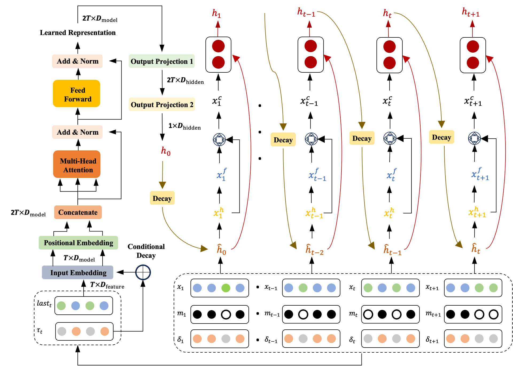

# CSAI: Knowledge Enhanced Conditional Imputation for Healthcare Time-series

Official implementation of "[Knowledge Enhanced Conditional Imputation for Healthcare Time-series](https://arxiv.org/pdf/2312.16713)"

## Overview

CSAI (Conditional Self-Attention Imputation) is a novel recurrent neural network architecture designed to handle complex missing data patterns in multivariate time series from electronic health records (EHRs). Key features:

- Domain-informed temporal decay mechanism adapted to clinical data recording patterns
- Attention-based hidden state initialization for capturing long and short-range dependencies
- Non-uniform masking strategy that reflects real-world missingness patterns

## Model Architecture



## Installation

```bash
# Clone the repository
git clone https://github.com/LinglongQian/CSAI.git
cd CSAI

# Create conda environment
conda env create -f csai.yml

# Activate environment
conda activate csai
```
Or
```bash
# Clone the repository
git clone https://github.com/LinglongQian/CSAI.git
cd CSAI

python -m venv csai

source csai/bin/activate

# Install dependencies
pip install -r requirements.txt
```

## Dataset Preparation

The implementation supports three healthcare benchmark datasets:

1. **PhysioNet Challenge 2012**
   - 4,000 ICU stays with 35 variables
   - [Download link](https://physionet.org/content/challenge-2012/1.0.0/)

2. **MIMIC-III**
   - 59 variables benchmark
   - Requires [credentialed access](https://physionet.org/content/mimiciii/1.4/)

3. **eICU**
   - 20 variables benchmark
   - Available after [registration](https://physionet.org/content/eicu-crd/2.0/)

Place the downloaded data in the `data/` directory following this structure:
```
data/
├── physionet_raw/
├── mimic_59f_raw/
└── eicu_raw/
```

## Usage

### Data Preprocessing
```bash
python data_process.py \
   --data_dir ./data/physionet_raw \
   --output_dir ./data/physionet \
   --n_splits 5 \
   --seed 3407
```

### Training example
```bash
python main.py \
    --dataset physionet \
    --model_name CSAI \
    --task I \  # I for imputation, C for classification
    --gpu_id 0 \
    --epoch 300 \
    --lr 0.0005 \
    --batchsize 64
```

### Training Arguments
```
Hardware:
  --gpu_id        GPU device ID
  --seed          Random seed for reproducibility

Model:
  --model_name    Model architecture [CSAI, Brits, GRUD, BVRIN, MRNN]
  --hiddens      Hidden layer size
  --channels     Number of channels
  --step_channels Step channels for transformer

Training:
  --task         Task type [I: Imputation, C: Classification]
  --epoch        Number of training epochs
  --lr          Learning rate
  --batchsize   Batch size
  --weight_decay Weight decay factor

Loss Weights:
  --imputation_weight      Weight for imputation loss
  --classification_weight  Weight for classification loss (task C)
  --consistency_weight    Weight for consistency loss
```

### Results Processing
Process and analyze training results:
```bash
python result_process.py \
    --log_dir ./log \
    --dataset physionet \
    --key_pattern bets_valid \
    --results_dir results
```

### Processing Arguments
```
--log_dir      Root directory containing experiment logs
--dataset      Dataset name [physionet, mimic_59f, eicu]
--key_pattern  Pattern to match in result keys
--results_dir  Directory to save processed results
```

## Citation

```bibtex
@article{qian2023knowledge,
  title={Knowledge Enhanced Conditional Imputation for Healthcare Time-series},
  author={Qian, Linglong and Raj, Joseph Arul and Ellis, Hugh Logan and Zhang, Ao and Zhang, Yuezhou and Wang, Tao and Dobson, Richard JB and Ibrahim, Zina},
  journal={arXiv preprint arXiv:2312.16713},
  year={2023}
}
```

## License

This project is licensed under the MIT License - see the [LICENSE](LICENSE) file for details.

## Acknowledgments

This research was supported by [funding details from paper]. The codebase builds upon several excellent repositories:
- [BRITS](https://github.com/caow13/BRITS)
- [PyPOTS](https://github.com/WenjieDu/PyPOTS)
